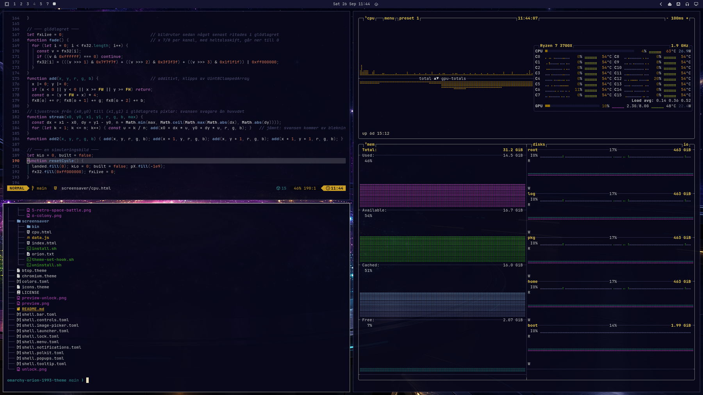

# Orion 1993

An [Omarchy](https://omarchy.org) theme in the spirit of the early-nineties 4X space games:
navy panels, bevelled steel frames and gold, with colors sampled from a 320×200 VGA palette.



## Install

```bash
omarchy theme install https://github.com/dennisp80/omarchy-orion-1993-theme
```

That gives you the colors, window borders, icons (Yaru yellow), six backgrounds (cycle them with
Super + Ctrl + Space), the lock screen and the ORION emblem on the unlock screen.
For the boot splash as well (asks for your password):

```bash
omarchy plymouth set by theme orion-1993
```

## The screensaver (optional)

The theme comes with its own screensaver: gold pixels assemble the ORION emblem, it glows,
a shockwave rolls out and the emblem explodes into a jump to lightspeed. Then the whole
background is rebuilt by its own pixels, flying back in from every direction, in their own colors,
in random order, over about a minute.

Omarchy doesn't let a theme run code by itself, so the screensaver is a separate, opt-in step:

```bash
~/.config/omarchy/themes/orion-1993/screensaver/install.sh
```

The script explains what it does before it does anything. In short, it adds:

- a wrapper in `~/.local/share/orion-1993/bin/` that is first on `PATH` (via `~/.config/uwsm/env`).
  It only takes over while this theme is active; with any other theme, Omarchy's own screensaver runs.
- a theme-set hook that switches the screensaver text to the ORION emblem for this theme.

Log out and back in once afterwards. Try it with `omarchy-launch-screensaver force`.
**Esc** (or any key, or moving the mouse) ends it. Undo everything with `screensaver/uninstall.sh`.

The screensaver is a web page shown in a kiosk window of Chromium, Chrome or Brave:

| File | What |
|---|---|
| `screensaver/index.html` | GPU version: WebGL2, one particle per screen pixel (~5 M at 3440×1440), all computed in the vertex shader. About half a CPU core. |
| `screensaver/cpu.html` | Used automatically when there is no GPU (SwiftShader/llvmpipe). Demoscene tricks: ~310 k carriers that each paste a sharp 4×4 tile on landing, a half-resolution glow layer that only fades (comet tails and bloom for free), capped at 60 fps. About 1.6 cores in Chromium's pure software path. |
| `screensaver/data.js` | The emblem and the background image the screensaver builds. |

The final picture is pixel-exact in both versions: nothing is faded in, every pixel is flown into place.
Without a browser the screensaver falls back to Omarchy's text effects, tinted in the theme's colors.

## Credits

- The backgrounds and the ORION emblem were generated with an AI image model (OpenAI) and then
  remapped to the palette.
- Inspired by, and not affiliated with, the classic space strategy games of 1993.

## License

[MIT](LICENSE)
